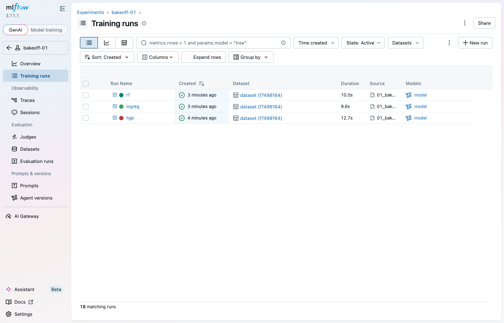
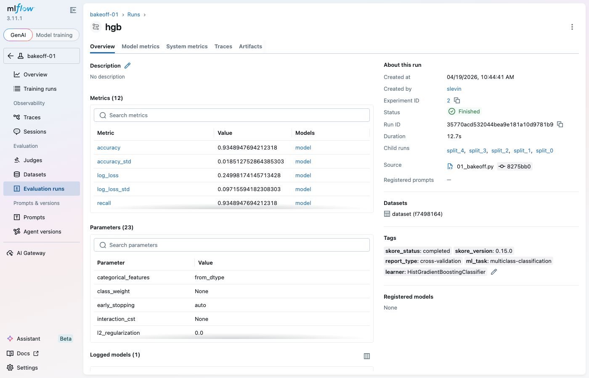
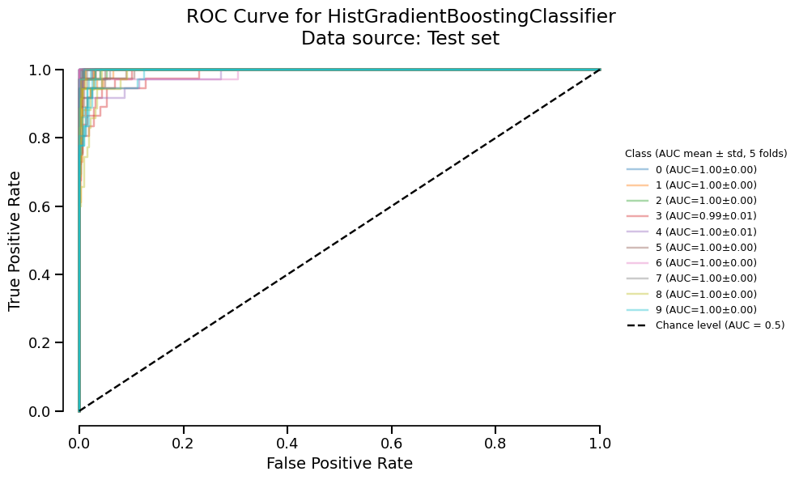

# Modernizing the skore ⇄ MLflow demo

*2026-04-19T16:50:53Z by Showboat 0.6.1*
<!-- showboat-id: d013bb7f-d33f-4282-94ed-34d8c68aeb07 -->

This repo started 2026-04-19 as a single obsolete Iris script with Windows-absolute paths and a pre-release skore install. Over ~45 minutes and 11 PRs, it became a cross-platform portfolio of five demos plus CI, screenshots, and a notebook. The editorial point of view: **MLflow is where models land for operations; skore is how a data scientist decides what deserves to land.**

Every PR on `main`, newest first:

```bash
git log --oneline -15
```

```output
1d74e59 docs: add delivery deck and report, fix skore docs URL (#26)
f6d6517 docs: add MLflow UI and skore screenshots to README (#25)
aeed332 ci: add cross-platform GitHub Actions workflow (#23)
f182425 feat: add notebook companion for bake-off demo (#24)
8275bb0 feat: add audit-ready demo with model card export (#22)
69f2e30 feat: add model bake-off example (#21)
7b58f21 feat: add time-series forecasting demo with per-fold view (#20)
bea742d feat: add shift-left methodology vignette (#19)
17233d1 feat: add skrub + skore + MLflow integration demo (#18)
614dabe chore: archive ux-campaign/ to ux-campaign-archive branch (#17)
b0c64df docs: add pickle-free serialization roadmap note (#16)
73a3839 feat: modernize install and main script to released skore API (#15)
349970d Add claude code transcripts
6a8504d add virtual UX testing campaign for MLflow + JupyterLab + skore
30c9d81 docs: update README with setup instructions and run results
```

**The main script.** Rewritten around `skore.evaluate(estimator, X, y, splitter=5)` — the released API that replaces direct `CrossValidationReport(...)` construction. The `redirect_stdout/stderr` ceremony is gone; the flow (train → put → summarize → get_run → reload) is preserved:

```bash
sed -n '1,35p' plot_mlflow_backend.py
```

```output
"""
Connect MLflow to skore.

Trains a HistGradientBoostingClassifier on the Iris dataset with 5-fold
cross-validation via skore's `evaluate`, then stores the resulting report in
an MLflow backend through `skore.Project(mode="mlflow")`.
"""

import os

import mlflow
import pandas as pd
from sklearn.datasets import load_iris
from sklearn.ensemble import HistGradientBoostingClassifier

from skore import Project, evaluate

# Configuration — override via environment variables or edit directly
PROJECT = os.environ.get("PROJECT", "iris-hgb-project")
TRACKING_URI = os.environ.get("TRACKING_URI", "sqlite:///mlflow.db")

# 1. Build a report
X, y = load_iris(return_X_y=True, as_frame=True)
estimator = HistGradientBoostingClassifier()
report = evaluate(estimator, X, y, splitter=5)

# 2. Push the report to MLflow backend
project = Project(
    PROJECT,
    mode="mlflow",
    tracking_uri=TRACKING_URI,
)

project.put("hgb-baseline", report)
print("Report stored in MLflow experiment:", PROJECT)
```

**The example portfolio.** Each script reinforces a different lens on the same workflow:

```bash
ls examples/
```

```output
01_bakeoff.ipynb
01_bakeoff.py
02_shift_left.py
03_timeseries_regime.py
04_skrub_integration.py
05_audit_ready.py
```

**Bake-off (examples/01_bakeoff.py).** Three estimators on Digits. The punchline: highest mean ≠ most stable. The ranking block does the arithmetic:

```bash
sed -n '80,110p' examples/01_bakeoff.py
```

```output
    # 5. Rank by (mean, std) on the chosen metric
    stats = {}
    for slug, report in reports.items():
        folds = per_fold_accuracy(report)
        stats[slug] = (float(folds.mean()), float(folds.std(ddof=1)))

    ranked = sorted(stats.items(), key=lambda kv: kv[1][0], reverse=True)

    print(f"\n=== Ranking by mean {METRIC} (5-fold CV) ===")
    print(f"{'rank':<5}{'model':<10}{'mean':>10}{'std':>10}")
    for i, (slug, (mean, std)) in enumerate(ranked, start=1):
        print(f"{i:<5}{slug:<10}{mean:>10.4f}{std:>10.4f}")

    # 6. Stability-vs-mean punchline
    top_slug, (top_mean, top_std) = ranked[0]
    most_stable_slug, (stable_mean, stable_std) = min(
        stats.items(), key=lambda kv: kv[1][1]
    )
    if most_stable_slug != top_slug and stable_std > 0:
        ratio = top_std / stable_std
        print(
            f"\nNote: {top_slug} has the top mean {METRIC.lower()} "
            f"({top_mean:.4f}) but {most_stable_slug} has ~{ratio:.1f}x "
            f"tighter per-fold spread (std {stable_std:.4f} vs {top_std:.4f})."
        )
    else:
        print(
            f"\nNote: {top_slug} leads on both mean ({top_mean:.4f}) "
            f"and per-fold stability (std {top_std:.4f}) for this run."
        )

```

**Shift-left (examples/02_shift_left.py).** Same estimator, same data, two splitters. On a synthetic series with drifting class balance, shuffled KFold over-reports accuracy — the TimeSeriesSplit numbers are the honest ones:

```bash
sed -n '75,110p' examples/02_shift_left.py
```

```output
    estimator = LogisticRegression(max_iter=1000)

    # --- Run 1: shuffled KFold on temporally-ordered data (wrong) ------------
    print("=== Run 1: KFold(shuffle=True) — methodologically wrong ===")
    with warnings.catch_warnings(record=True) as captured:
        warnings.simplefilter("always")
        shuffled_report = evaluate(
            estimator,
            X,
            y,
            splitter=KFold(n_splits=5, shuffle=True, random_state=0),
        )

    if captured:
        for item in captured:
            print(f"METHODOLOGICAL WARNING: {item.message}")
    else:
        print(
            "(no warning captured via the `warnings` module — "
            "skore 0.15 surfaces methodology warnings from `train_test_split` "
            "via rich-rendered stdout panels, not from `evaluate`. "
            "The numeric gap below is the real evidence of leakage.)"
        )

    # --- Run 2: TimeSeriesSplit (correct) ------------------------------------
    print("\n=== Run 2: TimeSeriesSplit — correct ===")
    tss_report = evaluate(
        estimator,
        X,
        y,
        splitter=TimeSeriesSplit(n_splits=5),
    )

    # --- Persist both reports to MLflow in the same experiment ---------------
    project = Project(PROJECT, mode="mlflow", tracking_uri=TRACKING_URI)
    project.put("shuffled-kfold-wrong", shuffled_report)
```

**Cross-platform CI.** Six-cell matrix (Linux / macOS / Windows × Python 3.11 / 3.12), all green on main. The workflow pins `shell: bash` on every run step so the `for` loop over `examples/*.py` behaves identically on Windows (Git Bash) and Unix:

```bash
sed -n '1,30p' .github/workflows/ci.yml
```

```output
name: CI

on:
  push:
  pull_request:

jobs:
  test:
    name: ${{ matrix.os }} / py${{ matrix.python-version }}
    runs-on: ${{ matrix.os }}
    strategy:
      fail-fast: false
      matrix:
        os: [ubuntu-latest, macos-latest, windows-latest]
        python-version: ["3.11", "3.12"]

    steps:
      - name: Checkout
        uses: actions/checkout@v4

      - name: Install uv
        uses: astral-sh/setup-uv@v6
        with:
          python-version: ${{ matrix.python-version }}

      - name: Cache dataset downloads
        uses: actions/cache@v4
        with:
          path: |
            ~/.cache/skrub
```

**Visual proof.** Three PNGs captured via headless Playwright against a live MLflow UI (plus one matplotlib render for the skore ROC view), already embedded in the README:







**Package shape.** A minimal `pyproject.toml` with `[tool.uv] package = false` lets `uv sync` work on a fresh clone without needing a build backend:

```bash
cat pyproject.toml
```

```output
[project]
name = "mlflow-skore-demos"
version = "0.1.0"
description = "skore ⇄ MLflow integration demos"
requires-python = ">=3.11"
dependencies = [
    "skore[mlflow]>=0.15",
    "scikit-learn",
    "pandas",
    "mlflow>=3.10",
    "skrub",
]

[tool.uv]
package = false
```

**Where `ux-campaign/` went.** The prior UX-exploration directory lives on an orphan archive branch. The README footer links to it; `main` stays scoped to the demo:

```bash
git ls-remote origin 'refs/heads/ux-campaign-archive' | awk '{print $1, "refs/heads/ux-campaign-archive"}'
```

```output
e742411fab55ccbeb1f4dc4fa6c1ae46fc935996 refs/heads/ux-campaign-archive
```

**Final state.** Epic #2 closed. 12 child issues closed. 11 PRs merged. CI green on main. The README tells the story through code and three screenshots — the slides and report (`docs/slides.html`, `docs/REPORT.md`) walk through the process; you're reading the executable version of the same story. Run `showboat verify docs/DEMO.md` from the repo root to re-execute every code block above and confirm nothing drifted.
