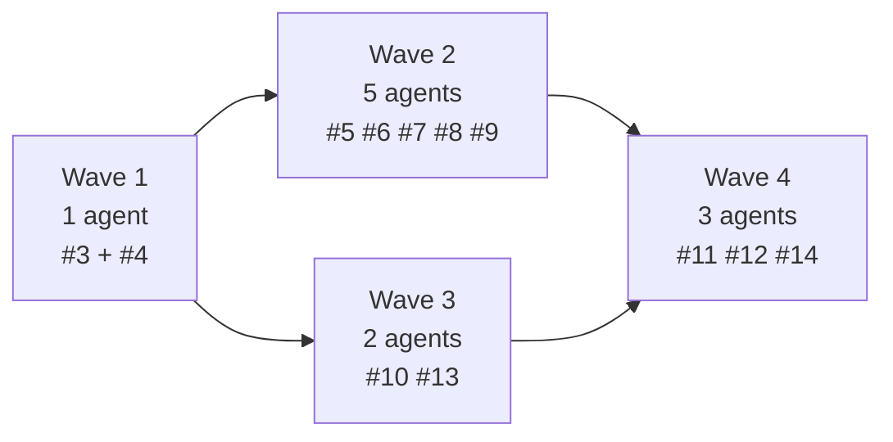

# Modernizing the skore ⇄ MLflow demo

**From one obsolete Iris script to a portfolio of cross-platform demos**

Delivery review — 2026-04-19
Repo: `github.com/slevin48/mlflow`

---

## The editorial point of view

> **MLflow is where models land for operations.**
>
> **skore is how a data scientist decides what deserves to land.**

Every example in the repo should reinforce that framing through code — no slogans, no vendor pitches.

---

## Starting state

- **1 script** — Iris + `HistGradientBoostingClassifier`, single-file demo
- **Install** pinned to a pre-release skore branch (`PR #2532`), gated by `GIT_LFS_SKIP_SMUDGE=1`
- **Windows-absolute paths** in every documented command (`D:/devel/mlflow/.venv/Scripts/python.exe`)
- **`ux-campaign/`** — 106 files of unrelated UX exploration (~9 MB) commingled with the demo
- **No `pyproject.toml`, no `uv.lock`, no CI, no visuals**

---

## The ask

1. Catch up to released skore: `uv pip install "skore[mlflow]"`
2. Replace Windows paths with cross-platform invocations
3. Expand the single Iris example into a small portfolio covering model comparison, methodology, time-series, preprocessing, audit readiness
4. Quarantine `ux-campaign/` to an archive branch
5. Wire up CI and README visuals
6. **Hard rule:** public repo — no firm / partner / customer names, no aliased references

---

## Approach: plan, then swarm

**Phase 1 — plan and file** (once, sequentially)

- 1 epic issue + 12 child issues on GitHub
- Dependency graph baked into the issue bodies
- 5 new labels created: `epic`, `chore`, `ci`, `demo`, `regulated-industries`

**Phase 2 — implement in parallel waves** (eleven agents, ten worktrees)

- Each agent: its own isolated git worktree so `uv sync`, script execution, and `mlflow.db` writes never collide
- Each agent: one feature branch, one PR, `Closes #N`

---

## Dependency graph

- **Wave 1** — modernize root files (overlapping scope, one bundled PR)
- **Wave 2** — 5 new example scripts (zero file conflicts, parallel safe)
- **Wave 3** — cleanup + docs note (runs in parallel with Wave 2)
- **Wave 4** — CI, screenshots, notebook (needs examples to exist first)

---

## What ships on `main`

**Scripts**
- `plot_mlflow_backend.py` — rewritten around `skore.evaluate(..., splitter=5)`
- `examples/01_bakeoff.py` — 3-estimator comparison on Digits
- `examples/02_shift_left.py` — `KFold(shuffle=True)` vs `TimeSeriesSplit`
- `examples/03_timeseries_regime.py` — per-fold view on non-stationary series
- `examples/04_skrub_integration.py` — `skrub.tabular_pipeline` + `HGBR`
- `examples/05_audit_ready.py` — model card as MLflow artifact

**Plus**
- `examples/01_bakeoff.ipynb` (executed, outputs committed)
- `.github/workflows/ci.yml` (6-cell matrix)
- `docs/assets/*.png` (3 screenshots embedded in README)
- `pyproject.toml` + `uv.lock`

---

## The five demos, one sentence each

| # | Script | Punchline |
|---|---|---|
| 01 | bake-off | **Highest mean ≠ most stable** — RF wins on mean accuracy; HGB has ~1.6× tighter per-fold spread |
| 02 | shift-left | **Shuffled CV over-reports by 5+ accuracy points** on temporally drifted data; `TimeSeriesSplit` exposes the real spread |
| 03 | time-series regime | **Per-fold RMSE swings 45 %+ across folds** under a mid-series regime shift — the mean across folds hides the broken one |
| 04 | skrub | **Pipeline provenance shows up on the MLflow run** — dirty tabular data, zero manual preprocessing |
| 05 | audit-ready | **The full audit trail lives on the MLflow run** as a Markdown model card artifact, not on a laptop |

---

## Results — the numbers

| | |
|---|---|
| Epic + children filed | **1 + 12** |
| PRs opened | **11** |
| PRs merged | **11** |
| Issues closed | **12** |
| Wall-clock duration | **≈ 45 min** |
| Demo Python on `main` | **≈ 861 lines** across 6 scripts |
| Screenshots in README | **3** (all under the size cap) |
| CI cells on PR branch | **12 / 12 green** |
| CI cells on `main` | **6 / 6 green** |
| OS × Python coverage | linux / macos / windows × 3.11 / 3.12 |

---

## Cross-platform proof: CI green on main

All six matrix cells passed on the first `main` push after `#23` merged:

| | Python 3.11 | Python 3.12 |
|---|---|---|
| `ubuntu-latest` | pass | pass |
| `macos-latest` | pass | pass |
| `windows-latest` | pass | pass |

Every script runs in every cell. Dataset caches (`~/.cache/skrub`, `~/scikit_learn_data`) persist across runs. Failed jobs upload `mlflow.db` + `mlruns/` as artifacts for debugging.

---

## Judgment calls worth knowing

- **skore's methodology warnings don't fire from `evaluate()` in 0.15** — only from `train_test_split`, and as `rich` panels. `02_shift_left.py` surfaces the methodology contrast through the numeric gap instead. Documented in the PR body.
- **Digits, not Iris, for the bake-off.** Iris with sensible defaults collapses the stability-vs-mean tradeoff. Digits preserves it and is still a sklearn built-in.
- **Real `sex` column on Adult, not synthetic sensitive features.** Avoids fabricating demographics for a demo.
- **Archive branch via git plumbing** (`git mktree` + `git commit-tree`) — parentless orphan commit, no working-tree gymnastics.

---

## The story the repo now tells

**Land a model on MLflow.** Three lines of code against the released API.
**Compare models** with `ComparisonReport` — stability-vs-mean visible in both the printed ranking and the MLflow UI.
**Catch a methodology bug upstream** — shuffled CV on temporal data over-reports, `TimeSeriesSplit` grounds it.
**Handle messy data** with `skrub.tabular_pipeline`; the pipeline shows up on the MLflow run.
**Ship an audit card** as a single-file MLflow artifact on the same run.

One workflow, two lenses. MLflow is operations. skore is methodology.

---

## Outstanding items

**Non-blocking**

- 10 agent worktrees under `.claude/worktrees/` are system-locked (~5 GB on disk, mostly duplicated `.venv` directories). One-liner to clean up is in the report.
- GitHub Actions deprecation warning on Node.js 20 runners. Upstream bumps land well before Sep 2026.
- Pre-existing issue `#1` remains open (out of scope).

**Future work**

- Bump the serialization roadmap note when `skore` adopts skops or equivalent.
- Optional second time-series example on a real public dataset.
- Publish the notebook via nbviewer for output-visible sharing.

---

## Wrap

- **Definition of done:** all checked. CI green on main.
- **Repo state:** clean, cross-platform, self-contained, scoped.
- **Report:** `docs/REPORT.md`. These slides: `docs/slides.md`.

`marp docs/slides.md -o docs/slides.pdf` if you want the deck as a PDF.
