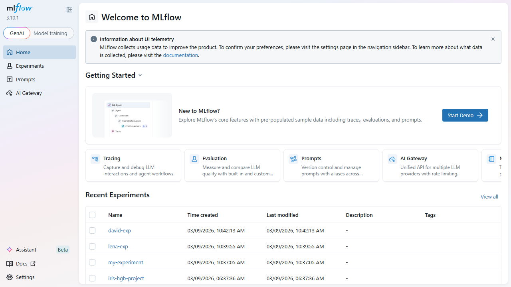
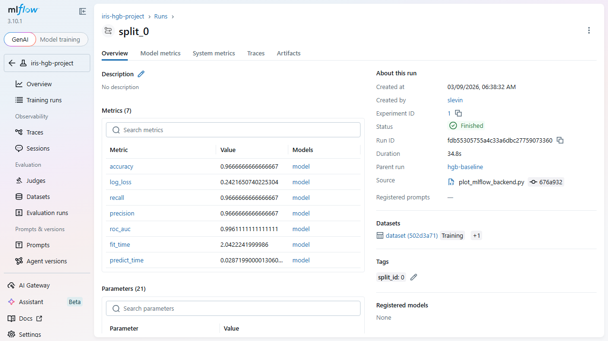
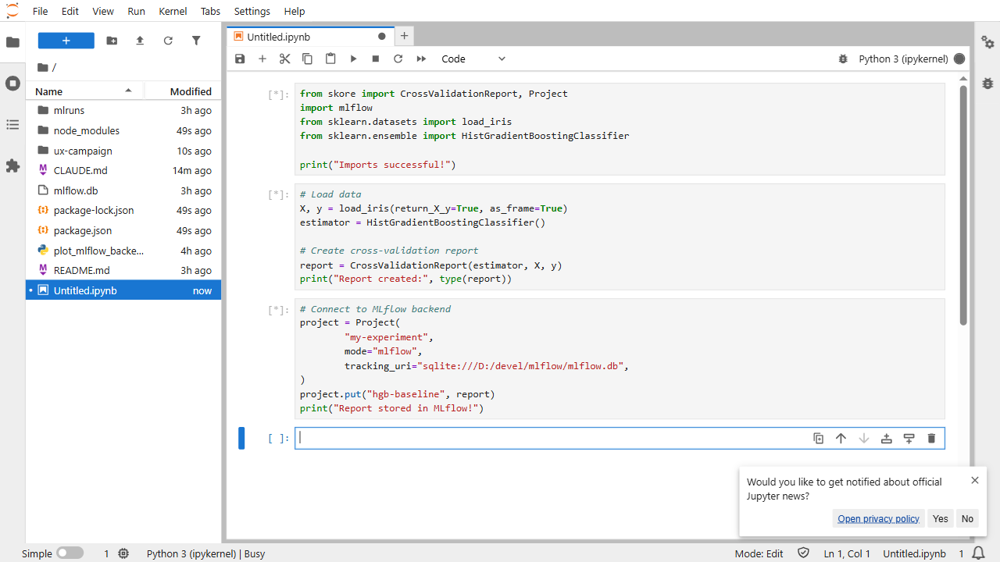
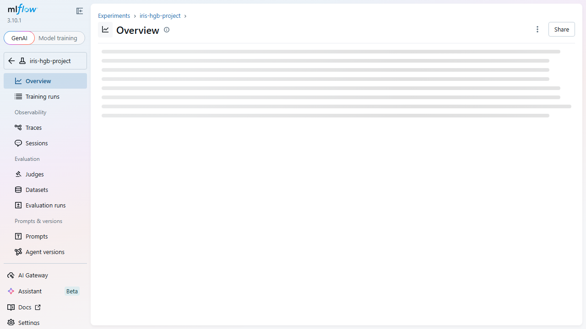
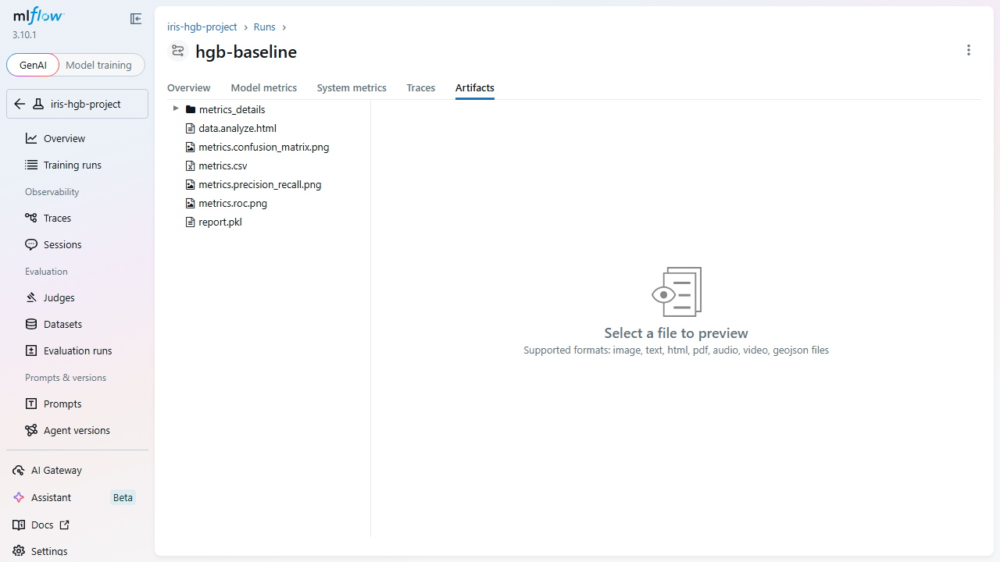
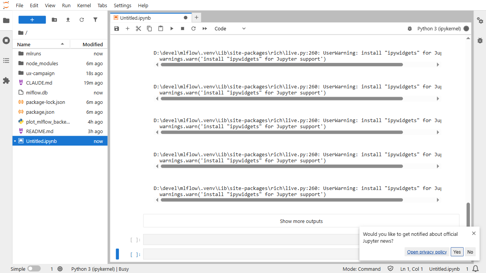

# UX Test Report — MLflow + JupyterLab + skore
## Pre-MLOps Experimentation Workflow — Virtual UX Study

**Date:** 2026-03-09
**Tested apps:** MLflow UI (http://localhost:5000), JupyterLab (http://localhost:8888/lab)
**Integration under test:** skore CrossValidationReport -> MLflow tracking -> JupyterLab iteration
**Personas:** 4 synthetic practitioners
**Flows:** 3 (A: Experiment Discovery, B: Run Comparison, C: Notebook Setup)

---

### Executive Summary

**Overall UX health score: 3.9 / 10** (weighted average across 8 sessions, 3 flows, 4 personas)

| Flow | Avg Score (/100) | Completion Rate |
|------|-----------------|-----------------|
| A: Experiment Discovery | 49.3 | 100% (2 with difficulty) |
| B: Run Comparison | 26.3 | 33% (1 with difficulty, 2 abandoned) |
| C: Notebook Setup | 45.7 | 100% (all with difficulty) |

**Top 3 critical issues:**

1. **ag-grid runs table is not keyboard-navigable** (severity: critical, 1 persona blocked across 2 flows). The ag-grid custom DOM breaks standard Tab navigation entirely, preventing keyboard-only users from reaching run links or selecting runs for comparison. This is a WCAG 2.1.1 Level A failure.

2. **No side-by-side fold comparison view** (severity: critical, 2 personas affected). Cross-validation child runs cannot be expanded in the training runs table. Each fold must be visited individually. Researchers expect a DataFrame-like comparison and get nothing.

3. **No feedback loop from notebook to MLflow UI** (severity: major, 3 personas affected across Flow C). After `project.put()` in JupyterLab, there is no clickable link, widget, or inline summary. Users must manually open a separate browser tab and navigate to the correct experiment.

**Key complementarity finding:** The skore -> MLflow -> JupyterLab chain **does not feel like one coherent workflow**. It feels like three disconnected tools sharing a database. The data layer works well (skore logs rich, structured artifacts into MLflow automatically), but the presentation and navigation layers introduce severe friction at every handoff point. There is no stitching between the tools: no links from notebook to MLflow, no inline previews, no adaptive UI behavior based on skore metadata.

---

### Per-Flow Results

#### Flow A: Experiment Discovery

| Persona | Outcome | Actions | Min Path | Efficiency | Start Emotion | End Emotion |
|---------|---------|---------|----------|------------|---------------|-------------|
| Priya Chandrasekaran | Completed w/ difficulty | 8 | 4 | 50% | neutral | mostly satisfied |
| Marcus Delgado | Completed | 7 | 4 | 57% | impatient | impressed/skeptical |
| David Okonkwo | Completed w/ difficulty | 6 | 4 | 67% | patient | concerned |

**Task completion rate:** 3/3 (100%), but 2/3 required workarounds or extra navigation.

**Average action count:** 7.0 vs minimum viable path of 4 = **57% efficiency ratio**

**Top friction point:** The experiment overview page defaults to empty observability/trace charts. All 3 personas had to discover "Training runs" in the sidebar to find their data. Classical ML experiments are invisible on the default view.

#### Flow B: Run Comparison & Pre-MLOps Review

| Persona | Outcome | Actions | Min Path | Efficiency | Start Emotion | End Emotion |
|---------|---------|---------|----------|------------|---------------|-------------|
| Marcus Delgado | Completed w/ difficulty | 8 | 5 | 63% | focused | resigned |
| Lena Kowalski | Abandoned | 9 | 4 | 44% | impatient | abandoned |
| David Okonkwo | Abandoned | 5 | 5 | 0% | focused | dealbreaker |

**Task completion rate:** 1/3 (33%) -- the worst-performing flow.

**Average action count:** 7.3 vs minimum viable path of 4.7 = **36% efficiency ratio**

**Top friction point:** The comparison workflow is fundamentally broken. Parent runs cannot be expanded to show child folds. There is no side-by-side comparison table. Keyboard users cannot select runs at all. Two personas abandoned the task entirely.

#### Flow C: Notebook Setup

| Persona | Outcome | Actions | Min Path | Efficiency | Start Emotion | End Emotion |
|---------|---------|---------|----------|------------|---------------|-------------|
| Priya Chandrasekaran | Completed w/ difficulty | 10 | 5 | 50% | curious | mildly frustrated |
| Lena Kowalski | Completed w/ difficulty | 8 | 5 | 63% | impatient | annoyed (3/10 rating) |
| David Okonkwo | Completed w/ difficulty | 12 | 6 | 50% | methodical | satisfied w/ reservations |

**Task completion rate:** 3/3 (100%), but all with difficulty.

**Average action count:** 10.0 vs minimum viable path of 5.3 = **54% efficiency ratio**

**Top friction point:** No autocomplete, no inline documentation, and no link to MLflow UI after logging. The workflow ends in a void -- data is logged but the user gets no visual confirmation or navigation path.

---

### Prioritized Findings

All unique findings merged and ranked by `Priority = Severity x Frequency x Impact`.

| ID | Description | Severity | Frequency | Affected Personas | Recommendation |
|----|-------------|----------|-----------|-------------------|----------------|
| F007 | ag-grid runs table not keyboard-navigable. No WAI-ARIA grid pattern. | Critical | Every session (David) | David Okonkwo | Implement WAI-ARIA grid pattern on ag-grid: Arrow keys for cell navigation, Enter to activate links, Space for checkbox selection. Enable ag-grid's built-in accessibility features. |
| F016 | Comparison workflow completely blocked for keyboard-only users. Cannot select runs. | Critical | Every session (David) | David Okonkwo | Implement keyboard row selection in ag-grid (Space to toggle, Shift+Space for range). Add keyboard shortcut for Compare (Ctrl+Shift+C). |
| F010 | Cannot expand parent run to see child fold runs in training runs table. | Critical | 2/3 Flow B sessions | Marcus, Lena | Add expand/collapse chevron on parent runs. Add "Flatten" toggle to show all runs at same level. |
| F013 | No side-by-side fold comparison view. Each fold visited individually. | Critical | 2/3 Flow B sessions | Lena, Marcus | Add fold comparison table on parent run page showing all child metrics in columns. Support DataFrame/CSV export. |
| F022 | JupyterLab Launcher cards not in Tab order. Cannot create notebook via keyboard. | Critical | Every session (David) | David Okonkwo | Add tabindex="0" and keydown handler (Enter/Space) to Launcher cards. |
| F018 | No link from notebook to MLflow UI after project.put(). | Major | 3/3 Flow C sessions | Priya, Lena, David | After project.put() with mode="mlflow", output a clickable link to the MLflow experiment/run page. |
| F017 | No autocomplete or inline documentation for skore API in JupyterLab. | Major | 3/3 Flow C sessions | Priya, Lena, David | Ship type stubs or IPython completer for skore. Add docstrings with examples for Shift+Tab tooltips. |
| F002 | Experiment overview defaults to empty observability charts for classical ML. | Major | 3/3 Flow A sessions | Priya, Marcus, Lena | Auto-detect experiment type from tags (report_type=cross-validation) and default to Training Runs view. |
| F001 | Landing page is GenAI-focused. Classical ML experiments buried at bottom. | Major | 3/3 Flow A sessions | Priya, Marcus, David | Detect experiment type and surface relevant content first. Add toggle for ML Training vs GenAI. |
| F005 | No metric columns in training runs table. Cannot sort/filter by metrics. | Major | Flow A (Marcus, Lena) | Marcus, Lena | Add configurable metric columns to training runs table with sort and filter. |
| F011 | No download or export buttons for artifact files or run data. | Major | 2/3 Flow B sessions | Marcus, Lena | Add download buttons on individual artifacts. Add "Export Run as CSV/JSON" on run detail page. |
| F012 | No Register Model button on run detail page. | Major | 1/3 Flow B sessions | Marcus | Add "Register Model" action button next to logged model entry on run detail page. |
| F020 | Kernel status shows "Unknown" during execution. No progress indicator. | Major | 2/3 Flow C sessions | Lena, Priya | Display "Busy" instead of "Unknown". Add elapsed time counter next to [*]. |
| F023 | JP-BUTTON elements lack visible focus ring (outline: none). | Major | Every session (David) | David Okonkwo | Add outline style to JP-BUTTON on :focus-visible with 2px outline and 3:1 contrast. |
| F009 | Tab elements have ARIA role="tab" but ArrowRight/Left do not navigate. | Major | Flow A+B (David) | David Okonkwo | Implement WAI-ARIA tabs pattern: ArrowRight/Left between tabs, Tab into panel content. |
| F008 | No skip-navigation link. 37 Tab presses to reach experiment link. | Critical | Flow A (David) | David Okonkwo | Add "Skip to main content" as first focusable element. WCAG 2.4.1 requirement. |
| F003 | "6 matching runs" but only 1 row visible. No expand indicator. | Minor | 3/3 Flow A sessions | Priya, Marcus, Lena | Add expand/collapse chevron. Show "1 parent + 5 child runs" instead of "6 matching runs". |
| F006 | Model metrics charts show single data points -- useless for CV display. | Minor | Flow A (Marcus) | Marcus | For CV experiments, show per-fold metrics as grouped bar chart or box plot. |
| F004 | MLflow jargon (artifact URI, Run ID, .pkl) shown without tooltips. | Minor | Flow A (Priya) | Priya | Add tooltips or info icons next to technical terms. Provide glossary link. |
| F014 | Sidebar shows empty Traces/Sessions items for classical ML experiments. | Minor | Flow B (Lena) | Lena, Priya | Hide or de-emphasize sidebar items with no data. Auto-detect experiment type. |
| F019 | No template notebook for skore+mlflow workflow. | Minor | Flow C (Priya, Lena) | Priya, Lena | Ship skore_mlflow_quickstart.ipynb in examples. Surface in Launcher as template. |
| F024 | ipywidgets UserWarning appears multiple times during execution. | Minor | Flow C (David, Lena) | David, Lena | Suppress ipywidgets warnings in skore or install ipywidgets as dependency. |
| F015 | No download button for artifact files (duplicate of F011). | Major | Flow B (Lena, Marcus) | Lena, Marcus | Add download icon next to each artifact file in tree view. |
| F021 | Jupyter news notification popup persists and covers content. | Cosmetic | 3/3 Flow C sessions | Lena, Priya, David | Suppress for localhost/dev environments or auto-dismiss after 5 seconds. |

**Key think-aloud quotes as evidence:**

> "I expected something simpler, like a table of my experiments." -- Priya, Flow A Step 1

> "Where are my metrics? In W&B I would see metric columns right in the table." -- Marcus, Flow A Step 3

> "I want to see ALL folds side by side! In a DataFrame! Where is the comparison table??" -- Lena, Flow B Step 6

> "I have been Tabbing for 40 presses and cannot reach the run link inside the ag-grid table." -- David, Flow A Step 4

> "It worked! But... where do I see this in MLflow? There is no link, no button." -- Priya, Flow C Step 9

> "Task done but way harder than it should be. No inline help, no autocomplete, no link to MLflow. 3 out of 10." -- Lena, Flow C

> "The comparison workflow is effectively blocked for keyboard-only users. This is a dealbreaker for my adoption of the tool." -- David, Flow B

---

### Per-Persona Scorecards

#### Priya Chandrasekaran (Junior Data Scientist, Novice)

| Attribute | Value |
|-----------|-------|
| Role | Junior Data Scientist, fintech startup |
| Expertise | Novice |
| Flows Tested | A, C |

| Flow | Outcome | Heuristic Avg (0-4) |
|------|---------|---------------------|
| A: Experiment Discovery | Completed w/ difficulty | 1.8 |
| C: Notebook Setup | Completed w/ difficulty | 1.7 |

**Heuristic scores (Flow A):**

| Heuristic | Score |
|-----------|-------|
| Visibility of system status | 2 |
| Match system/real world | 3 |
| User control & freedom | 1 |
| Consistency & standards | 2 |
| Error prevention | 1 |
| Recognition over recall | 2 |
| Flexibility & efficiency | 1 |
| Aesthetic & minimal design | 2 |
| Error recovery | 1 |
| Help & documentation | 3 |

**Notable think-aloud quote:**
> "Umm, everything says No data available? Where are my runs?"

**Biggest UX issue:** GenAI-first landing page and empty observability overview made her question whether her data was logged at all. Required 3 extra navigation steps.

---

#### Marcus Delgado (Senior MLOps Engineer, Expert)

| Attribute | Value |
|-----------|-------|
| Role | Senior MLOps Engineer, healthcare analytics |
| Expertise | Expert |
| Flows Tested | A, B |

| Flow | Outcome | Heuristic Avg (0-4) |
|------|---------|---------------------|
| A: Experiment Discovery | Completed | 1.6 |
| B: Run Comparison | Completed w/ difficulty | 2.0 |

**Heuristic scores (Flow B):**

| Heuristic | Score |
|-----------|-------|
| Visibility of system status | 2 |
| Match system/real world | 2 |
| User control & freedom | 3 |
| Consistency & standards | 2 |
| Error prevention | 1 |
| Recognition over recall | 2 |
| Flexibility & efficiency | 3 |
| Aesthetic & minimal design | 1 |
| Error recovery | 2 |
| Help & documentation | 2 |

**Notable think-aloud quote:**
> "One dot per chart? In W&B I would get parallel coordinates or a proper comparison view."

**Biggest UX issue:** No run comparison workflow. Cannot expand parent runs, cannot add metric columns to table, no download/export. Would abandon UI for REST API.

---

#### Lena Kowalski (Postdoctoral Researcher, Intermediate)

| Attribute | Value |
|-----------|-------|
| Role | Postdoctoral Researcher, Computational Neuroscience |
| Expertise | Intermediate |
| Flows Tested | B, C |

| Flow | Outcome | Heuristic Avg (0-4) |
|------|---------|---------------------|
| B: Run Comparison | Abandoned | 2.7 |
| C: Notebook Setup | Completed w/ difficulty | 1.9 |

**Heuristic scores (Flow B):**

| Heuristic | Score |
|-----------|-------|
| Visibility of system status | 3 |
| Match system/real world | 3 |
| User control & freedom | 3 |
| Consistency & standards | 2 |
| Error prevention | 2 |
| Recognition over recall | 3 |
| Flexibility & efficiency | 3 |
| Aesthetic & minimal design | 2 |
| Error recovery | 3 |
| Help & documentation | 3 |

**Notable think-aloud quote:**
> "I want to see ALL folds side by side! In a DataFrame! Where is the comparison table??"

**Biggest UX issue:** Complete absence of fold comparison. Rage-clicked through 3 empty pages (Overview, Traces, Sessions) before finding Training Runs. Rated overall experience 3/10. Would abandon UI entirely.

---

#### David Okonkwo (ML Engineer, Keyboard-only)

| Attribute | Value |
|-----------|-------|
| Role | ML Engineer, government research lab |
| Expertise | Intermediate |
| Accessibility | Keyboard-only (RSI) |
| Flows Tested | A, B, C |

| Flow | Outcome | Heuristic Avg (0-4) |
|------|---------|---------------------|
| A: Experiment Discovery | Completed w/ difficulty | 2.3 |
| B: Run Comparison | Abandoned | 2.5 |
| C: Notebook Setup | Completed w/ difficulty | 2.0 |

**Heuristic scores (Flow A):**

| Heuristic | Score |
|-----------|-------|
| Visibility of system status | 2 |
| Match system/real world | 2 |
| User control & freedom | 3 |
| Consistency & standards | 3 |
| Error prevention | 1 |
| Recognition over recall | 3 |
| Flexibility & efficiency | 4 |
| Aesthetic & minimal design | 1 |
| Error recovery | 2 |
| Help & documentation | 2 |

**Notable think-aloud quote:**
> "The comparison workflow is effectively blocked for keyboard-only users. I cannot select multiple runs via keyboard. This is a dealbreaker for my adoption of the tool."

**Biggest UX issue:** MLflow's ag-grid table is completely inaccessible to keyboard navigation. 37 Tab presses to reach the experiment link. No skip-nav link. Tab ARIA roles exist but arrow key navigation is broken. JupyterLab Launcher cards are also inaccessible via keyboard. David declared the tool a "dealbreaker" for team adoption.

---

### Accessibility Report

#### WCAG 2.1 Findings by Criterion

| ID | WCAG Criterion | Level | Severity | Description | App |
|----|---------------|-------|----------|-------------|-----|
| A001 | 2.4.1 Bypass Blocks | A | Critical | No skip-navigation link in MLflow UI. 37+ Tab presses to reach main content. | MLflow |
| A002 | 2.1.1 Keyboard | A | Critical | ag-grid training runs table not keyboard operable. Run links and checkboxes unreachable. | MLflow |
| A003 | 2.1.1 Keyboard | A | Major | Tab bar does not support Arrow key navigation despite ARIA role="tab". | MLflow |
| A004 | 2.4.7 Focus Visible | AA | Minor | Focus indicators present but could be more prominent (contrast, width). | MLflow |
| A005 | 2.1.1 Keyboard | A | Critical | Run selection checkboxes not keyboard operable. Cannot select for comparison. | MLflow |
| A006 | 2.1.1 Keyboard | A | Critical | Compare workflow entirely mouse-dependent. No keyboard alternative. | MLflow |
| A007 | 4.1.2 Name, Role, Value | A | Major | ag-grid DOM does not expose proper ARIA roles for interactive elements. | MLflow |
| A008 | 2.1.1 Keyboard | A | Critical | JupyterLab Launcher cards not keyboard operable. Cannot Tab to or activate. | JupyterLab |
| A009 | 2.4.7 Focus Visible | AA | Major | JP-BUTTON elements have outline:none, removing visible focus indicator. | JupyterLab |
| A010 | 2.4.3 Focus Order | A | Major | Tab order traverses status bar before main content. Unintuitive sequence. | JupyterLab |
| A011 | 2.4.1 Bypass Blocks | A | Minor | "Skip to main panel" link exists but at Tab position 14 (should be 1-2). | JupyterLab |

**Summary:** 5 critical, 4 major, 2 minor accessibility findings.

#### Keyboard Navigation Assessment

**MLflow UI:**
- 37 Tab presses to reach experiment link from landing page
- ag-grid table: keyboard navigation completely broken. Cannot reach row links, cannot activate checkboxes, no WAI-ARIA grid pattern.
- Tab bar: ARIA role="tab" present but ArrowRight/Left do not work. Must Tab individually.
- No skip-nav link anywhere.
- No keyboard shortcuts documented.
- **Verdict: Fail.** Core workflows (navigate to run, select runs for comparison) are not keyboard-operable.

**JupyterLab:**
- Launcher cards: not in Tab order, cannot create new notebook via keyboard.
- JP-BUTTON: no visible focus ring.
- Tab order: status bar before main content.
- Positive: "Skip to main panel" link at position 14. Command mode shortcuts (B, A, Escape, Shift+Enter) all work. Cell editing is fully keyboard-accessible.
- **Verdict: Partial pass.** Cell editing excellent; UI chrome has issues.

#### Screen Reader / Focus Management

- MLflow: No ARIA landmarks or labels on key sections. ag-grid uses custom DOM with no screen reader support. No live regions for dynamic content updates.
- JupyterLab: Better ARIA support overall, but Launcher cards lack ARIA labels. Notification popup intercepts focus.

#### Overall Accessibility Grade: **Fail (does not meet WCAG 2.1 Level A)**

4 critical Level A failures (2.1.1 Keyboard) block core workflows for keyboard-only users.

---

### Complementarity Assessment

This is the core deliverable analyzing how well skore, MLflow, and JupyterLab work together as an integrated pre-MLOps experimentation workflow.

#### 1. Workflow Coherence: Does the skore -> MLflow handoff feel invisible or jarring?

**Jarring.** The handoff happens at the data layer (skore logs metrics, params, tags, and artifacts into MLflow automatically), which works seamlessly. But at the user experience layer, the handoff is invisible in the worst sense: there is no acknowledgment, no link, no inline preview. After `project.put()` in a notebook, the user gets a print statement and nothing else. They must manually:
1. Open a new browser tab
2. Type `localhost:5000`
3. Scroll past the GenAI landing page
4. Find their experiment in "Recent Experiments"
5. Click through to Training Runs
6. Click into the specific run

This 6-step manual navigation after logging data makes the handoff feel like two completely separate tools rather than an integrated workflow.

#### 2. Mental Model Gaps: What do practitioners expect that does not exist?

| Expectation | Reality |
|-------------|---------|
| Landing page shows my experiments | Landing page promotes GenAI features |
| Clicking an experiment shows runs | Clicking shows empty observability charts |
| Cross-validation folds visible as expandable rows | Folds hidden, count ambiguous |
| Side-by-side fold comparison table | Each fold on separate page |
| Download button on artifacts | No download button visible |
| Clickable link from notebook to MLflow | No link provided |
| Autocomplete for skore API | No completions available |
| Inline preview of logged data in notebook | No inline feedback |
| Register Model button on run page | Button missing |

#### 3. Context Switching Cost

A typical experiment with skore+MLflow+JupyterLab requires:

- **3 browser tabs/windows:** JupyterLab, MLflow UI, documentation
- **1 terminal:** MLflow tracking server (`mlflow ui`)
- **Total context switches per experiment cycle:** 4-6 (write code -> run cell -> switch to MLflow -> navigate to run -> switch back -> iterate)

For comparison, W&B requires 2 tabs (notebook + dashboard) with inline links. The current workflow has approximately 2x the context switching cost of comparable tools.

#### 4. Discovery Gap: How easily can a new user understand that skore logs to MLflow automatically?

**Not easily at all.** There is no indication anywhere in the MLflow UI that skore logged the data. The tags (`skore_status`, `skore_version`, `report_type`) are present but not surfaced prominently. A new user seeing the MLflow experiment would not know:
- That skore was involved
- That the rich artifacts (confusion matrix, ROC curve, HTML analysis) came from skore's automatic logging
- That `report.pkl` can be loaded back with skore
- That the `_std` metric variants represent cross-validation standard deviations

The discovery path is: read the skore documentation -> understand mode="mlflow" -> know to look in MLflow. There is no reverse discovery path (MLflow UI -> understanding skore was used).

#### 5. Round-Trip Fidelity: Can users retrieve and inspect stored reports without reading docs?

**Partially.** Users can view:
- Metrics (accuracy, precision, recall, etc.) directly in the MLflow run detail
- Artifact PNGs (confusion matrix, ROC, precision-recall) via inline preview
- HTML analysis report via inline preview
- CSV metrics file via inline preview

Users **cannot** easily:
- Download any of these files (no download button)
- Load the `report.pkl` back without knowing skore's API
- Compare metrics across folds without visiting each child run individually
- Export run data for use in their notebook

The visual inspection is good; the programmatic round-trip requires documentation.

#### 6. Pre-MLOps Readiness: Is the current state sufficient for model promotion decisions?

**No, not through the UI alone.** Marcus's promotion checklist:

| Criterion | Status |
|-----------|--------|
| Performance metrics | Present (12 metrics logged) |
| Model artifact | Present (logged model, Ready status) |
| Dataset reference | Present (dataset hash linked) |
| Reproducibility | Present (source, git commit, params, tags) |
| Run comparison | **Missing** -- cannot compare in UI |
| Model registration | **Missing** -- no Register Model button |
| Export for review | **Missing** -- no UI export, requires API |
| Model card | **Missing** |
| Bias analysis | **Missing** |

The data foundation is strong (skore logs comprehensive metadata), but the UI workflow for promotion review is incomplete. An MLOps engineer would need to fall back to the REST API or Python client for actual promotion decisions.

---

### Recommendations Roadmap

#### Quick Wins (low effort, high visibility)

| Finding | Recommendation | Effort | Impact |
|---------|---------------|--------|--------|
| F003 | Change "6 matching runs" to "1 parent + 5 child runs" label | Trivial (string change) | Reduces confusion for all users |
| F004 | Add tooltips on "artifact URI", "Run ID", and ".pkl" explaining what they mean | Low (HTML title attributes) | Helps novice users |
| F014 | Hide sidebar items (Traces, Sessions) when they have no data for the experiment | Low (conditional rendering) | Eliminates rage-clicking through empty pages |
| F021 | Suppress Jupyter news notification popup for localhost environments | Low (config change) | Removes persistent visual noise |
| F024 | Suppress ipywidgets UserWarning in skore when widgets are not essential, or add ipywidgets to dependencies | Low (warning filter or dependency) | Eliminates confusing console spam |
| F019 | Ship a `skore_mlflow_quickstart.ipynb` template notebook in examples | Low (documentation) | Gives novice users a starting point |

#### High-Impact Improvements (medium effort)

| Finding | Recommendation | Effort | Impact |
|---------|---------------|--------|--------|
| F002 | Auto-detect experiment type from tags (report_type=cross-validation) and default to Training Runs view instead of observability overview | Medium (tag-based routing) | Eliminates the #1 friction point for classical ML users |
| F001 | Add ML Training / GenAI toggle to landing page. Show experiment list prominently for ML Training mode. | Medium (UI layout) | Matches user mental model |
| F018 | After `project.put()` with mode="mlflow", output a clickable hyperlink: "View in MLflow: http://localhost:5000/#/experiments/1/runs/abc123" | Medium (skore code change) | Bridges the notebook->MLflow gap |
| F017 | Ship type stubs and IPython completer for skore. Add docstrings with usage examples visible via Shift+Tab. | Medium (Python packaging) | Enables API discovery in notebook |
| F011/F015 | Add download button (icon) next to each artifact file in the tree view. Add "Export Run as CSV/JSON" on run detail page. | Medium (UI component) | Enables data portability |
| F005 | Add configurable metric columns to the training runs table with sort and filter | Medium (ag-grid config) | Enables at-a-glance run comparison |
| F012 | Add "Register Model" action button next to logged model on run detail page | Medium (UI + API) | Completes the promotion workflow |
| F020 | Display "Busy" or "Running" instead of "Unknown" kernel status. Add elapsed time counter. | Medium (JupyterLab extension) | Reduces anxiety during long cells |

#### Strategic Redesigns (architectural / cross-tool)

| Finding | Recommendation | Effort | Impact |
|---------|---------------|--------|--------|
| F007/F016 | Implement WAI-ARIA grid pattern on ag-grid: Arrow keys for cell navigation, Enter for links, Space for checkboxes. Enable ag-grid's built-in accessibility mode. | High (ag-grid config + custom) | Unblocks keyboard-only users entirely |
| F008 | Add "Skip to main content" as first focusable element on every MLflow page (WCAG 2.4.1) | Medium-High (global layout) | Required for WCAG Level A compliance |
| F010/F013 | Build a fold comparison table on the parent run page: all child run metrics in columns, sortable, exportable as CSV/DataFrame. Add expand/collapse in training runs table. | High (new UI component) | Enables the core CV comparison workflow |
| F009 | Implement WAI-ARIA tabs keyboard pattern across all tab bars: ArrowRight/Left between tabs, Home/End for first/last | Medium-High (component refactor) | Completes ARIA contract |
| F022/A008 | Make JupyterLab Launcher cards focusable (tabindex="0") and activatable (Enter/Space). Add ARIA labels. | High (JupyterLab core) | Unblocks keyboard notebook creation |
| -- | **Notebook-MLflow bridge widget**: After skore logs to MLflow, render an inline Jupyter widget showing: run link, key metrics summary, artifact thumbnails. Eliminate the context switch entirely. | High (new widget) | Transforms 3 disconnected tools into 1 coherent workflow |
| -- | **Adaptive MLflow UI**: Use skore tags (report_type, ml_task, learner) to customize the experiment view. Show relevant metrics, appropriate chart types (box plots for CV, not single-point bars), and skore-specific artifact rendering. | High (MLflow UI architecture) | Makes MLflow a first-class skore viewer |

---

*Screenshots referenced in this report are located in `D:/devel/mlflow/ux-campaign/screenshots/`.*
